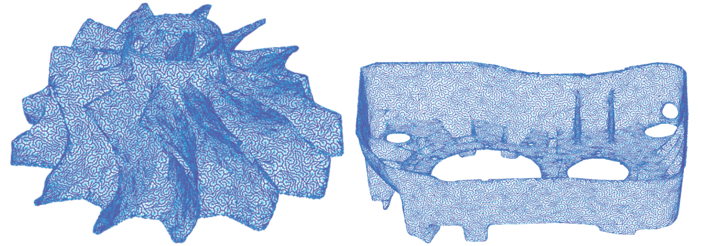

# Non-revisiting Uniform Coverage (NUC)

This repository is the ROS package for the journal paper entitled "Template-free Non-revisiting Uniform Coverage Path Planning on Curved Surfaces", IEEE/ASME Transactions on Mechatronics (T-Mech). 

[Paper Link](https://www.researchgate.net/publication/371391703)

This paper claimed that a physically uniform coverage path should be designed based on a physically uniform representation of the target surface, such as a triangular mesh, rather than enforcing a curvilinear coordinate. 
Typically resultant coverage paths generated by the proposed algorithm are as follows: 



The supplementary code in this repo is capable of generating the non-repetitive coverage path on ARBITRARY connected triangular mesh. Input a uniform mesh, and you will get a uniform coverage. 

## Video Link

[Supplementary Video](https://drive.google.com/file/d/1sYnp-nKgyRzVhqUaI8ly20HRpIq9SC3B/view?usp=sharing)

## Dependencies

1. trimesh (only if you want to test my python script first)
```
pip3 install trimesh
```

## Usage

1. Clone the code in the src folder of a ROS workspace
```
git clone https://github.com/ZJUTongYang/nuc_ros.git
```

2. Compile the workspace
```
catkin_make
```

This will create a python module named nuc, as well as ros messages and services. 

3. Start the algorithm
```
roslaunch nuc demo.launch
```
If everything is correct, there should be two rostopics, "/nuc_mesh" (of type nuc/MeshWithFrame) and "/nuc_path" (of type nav_msgs/Path). If a mesh is sent to the algorithm through "/nuc_mesh", a coverage path will be generated and published to "/nuc_path" whose frame was "nuc_demo_test_frame", designated in "/nuc_mesh". 

4. If you want to try my demo python script, start a new terminal and run (I assume you are still in the workspace directory) 
```
rosrun nuc demo.py src/nuc_ros/mesh_data/remeshed_saddle.stl
```

5. Start a new terminal and open a rviz window by typing
```
rosrun rviz rviz
```
add the topic "/nuc_path", and type the frame of rviz as "nuc_demo_test_frame" (you have to type in it instead of choose it). Finally, you will be able to see a coverage path designed for a saddle-shaped surface. 

## Bug Report

The code does not have any randomness so bugs can be easily reproduced. If your surface triggers a bug in my code, please send the mesh data to me. 

## Cite This Paper
```
@article{Yang2023Template,
  title={Template-Free Nonrevisiting Uniform Coverage Path Planning on Curved Surfaces},
  author={Yang, Tong and Miro, Jaime Valls and Nguyen, Minh and Wang, Yue and Xiong, Rong},
  journal={IEEE/ASME Transactions on Mechatronics},
  year={2023},
  volume={28},
  number={4},
  pages={1853--1861},
  publisher={IEEE}
}
```


